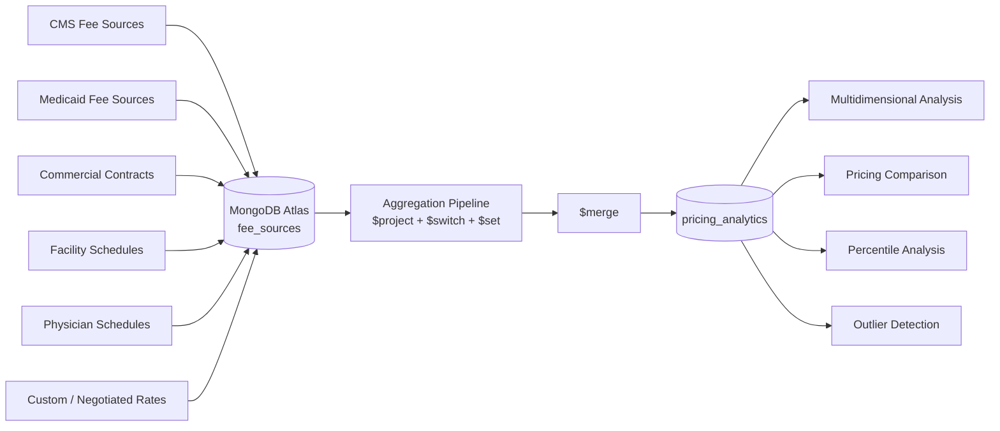
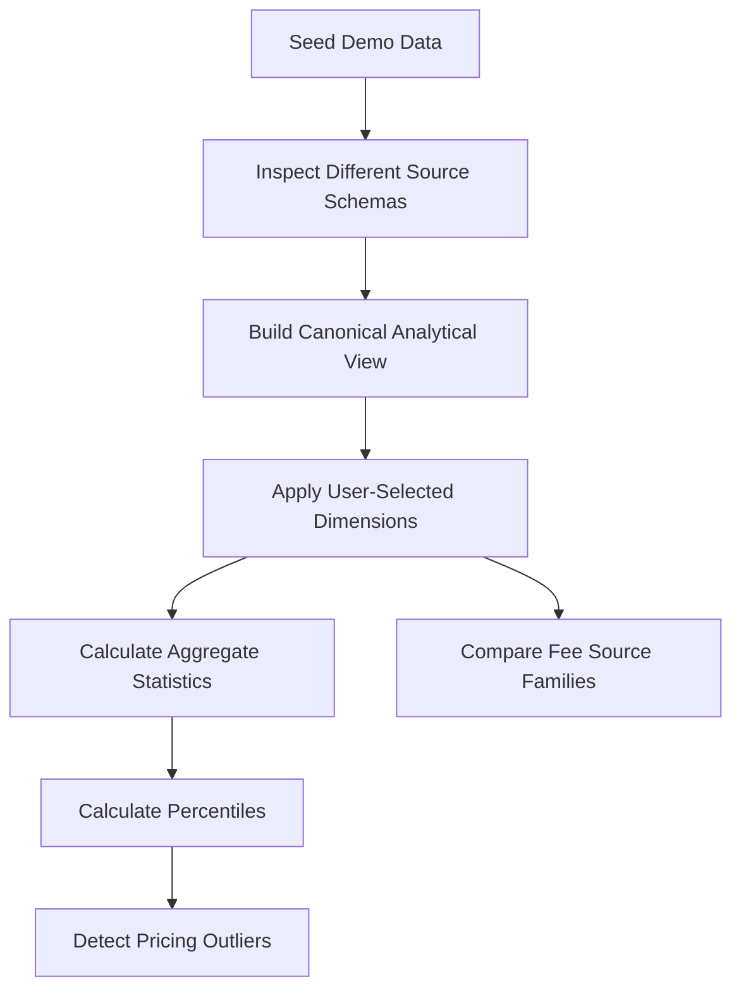
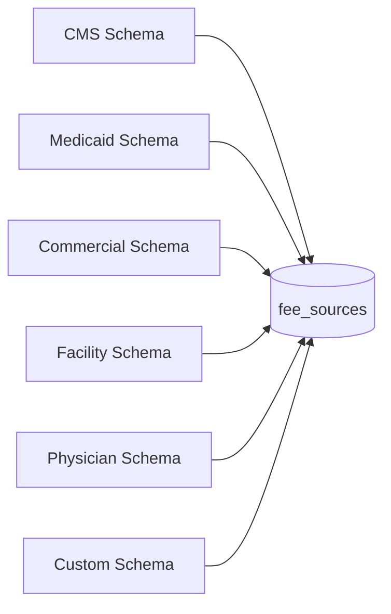
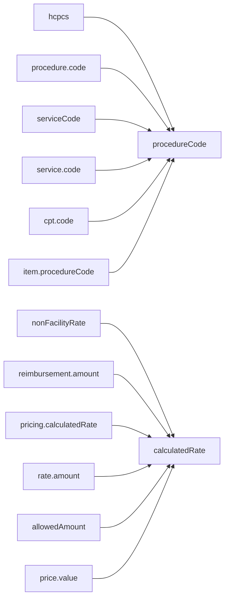
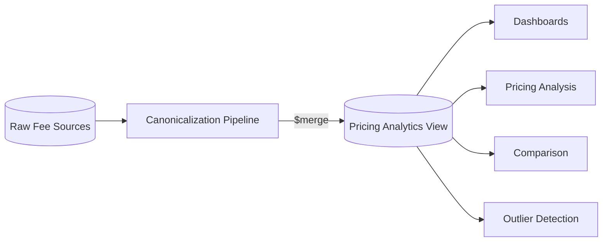
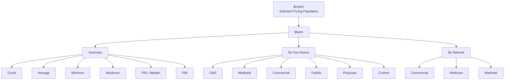
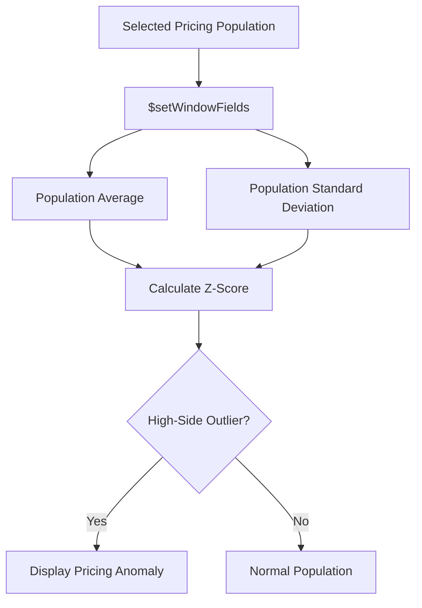
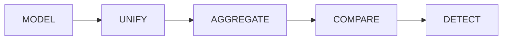
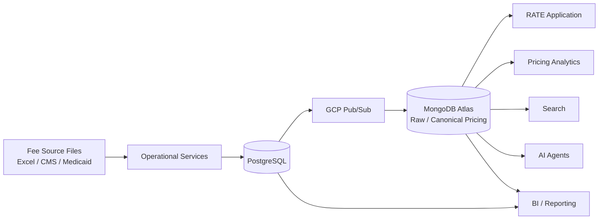

# UHG RATE Automation  Multidimensional Pricing

> **Purpose:** Demonstrate how MongoDB Atlas can provide a flexible analytical layer across heterogeneous fee sources, enabling multidimensional pricing analysis, comparison, and outlier detection without replacing the existing relational transactional workflow.

---

## Overview

The **RATE Automation** use case involves analyzing pricing across a large number of different fee structures.

The existing relational model works well for normal day-to-day fee schedule operations. The challenge appears when the business wants to treat many heterogeneous fee sources as a **single analytical population** and ask questions across dimensions such as:

- Procedure / service code
- Fee schedule
- Provider type
- Facility vs. physician
- State / geography
- Network
- Contract
- Pricing methodology
- Effective year
- Calculated rate

The demo shows how MongoDB Atlas can ingest multiple fee-source shapes, preserve their differences, and then create a **canonical analytical view** for cross-source pricing analysis.

---

# What the Demo Proves

The demo focuses on six MongoDB capabilities:

1. **Flexible Document Model**
2. **Polymorphic Data**
3. **Aggregation Framework**
4. **Materialized Analytical Views with `$merge`**
5. **Multidimensional Analysis using `$facet`, `$group`, and `$percentile`**
6. **Pricing Outlier Analysis using `$setWindowFields`**

NLP, Vector Search, and Hybrid Search are intentionally excluded from this application because those capabilities are demonstrated separately.

---

# High-Level Architecture



The important point is that MongoDB does **not** require every fee source to arrive with the same schema.

The raw documents remain heterogeneous.

MongoDB then creates a common analytical representation only for the dimensions required by RATE.

---

# Application Layout

The Streamlit application uses an intentionally retro **IBM / terminal-style interface**.

The demo controls are presented as a scripted sequence:

```text
[S] SEED DEMO DATA
[1] SHOW SOURCE VARIABILITY
[2] BUILD ANALYTICAL VIEW
[3] MULTIDIMENSIONAL ANALYSIS
[4] FIND PRICING OUTLIERS
[5] COMPARE FEE SOURCES
[R] RESET DEMO
```

This makes the application suitable for a MongoDB **Technical Feasibility Workshop (TFW)**.

The point is not to teach the audience how to code MongoDB.

The point is to visibly confirm that MongoDB satisfies the required capabilities.

---

# MongoDB Namespaces

The demo uses two collections.

```text
Database:
uhg_rate_demo
```

### Raw fee-source collection

```text
uhg_rate_demo.fee_sources
```

This collection contains intentionally heterogeneous source documents.

### Canonical analytical collection

```text
uhg_rate_demo.pricing_analytics
```

This collection is created by the aggregation pipeline and represents the common analytical model.

---

# Demo Flow



---

# 1. Seed Demo Data

The **SEED DEMO DATA** button loads multiple different fee-source representations into Atlas.

The data intentionally uses different schemas.

For example:

## CMS-style record

```json
{
  "sourceType": "CMS",
  "scheduleId": "CMS-TX-2026",
  "hcpcs": "99213",
  "description": "Office outpatient visit",
  "state": "TX",
  "network": "Commercial",
  "providerType": "Physician",
  "facilityRate": 101.52,
  "nonFacilityRate": 108.00,
  "effectiveDate": "2026-01-01"
}
```

## Medicaid-style record

```json
{
  "sourceType": "MEDICAID",
  "feeSource": "TX-MEDICAID",
  "procedure": {
    "code": "99213",
    "description": "Office outpatient visit"
  },
  "coverage": {
    "state": "TX",
    "network": "Medicaid",
    "providerType": "Physician"
  },
  "reimbursement": {
    "amount": 90.72,
    "method": "STATE_FEE_SCHEDULE",
    "effectiveDate": "2026-01-01"
  }
}
```

## Commercial-contract record

```json
{
  "sourceType": "COMMERCIAL",
  "contractId": "UHC-COMM-TX-481",
  "serviceCode": "99213",
  "serviceDescription": "Office outpatient visit",
  "market": {
    "state": "TX",
    "network": "Commercial"
  },
  "provider": {
    "type": "Physician"
  },
  "pricing": {
    "method": "PERCENT_OF_BENCHMARK",
    "factor": 1.19,
    "calculatedRate": 128.52
  }
}
```

These documents represent the core modeling challenge.

They describe related business concepts but do **not** use the same physical schema.

---

# 2. Flexible Document Model

This step demonstrates that MongoDB can store all of these fee-source representations in the same collection.



This is important for RATE because the analytical system does not need to force every source into an identical relational schema before the data can be stored.

Instead:

> **Preserve source-specific structure where useful, normalize only what is required for analysis.**

---

# 3. Canonical Analytical View

The **BUILD ANALYTICAL VIEW** step runs a real MongoDB aggregation pipeline.

Conceptually:

```text
$project
   ↓
$switch
   ↓
$set
   ↓
$merge
```

The `$switch` expressions map source-specific fields into common analytical dimensions.

For example:

```text
CMS                  Medicaid               Commercial
----------------     ----------------       ----------------
hcpcs                procedure.code         serviceCode
state                coverage.state         market.state
network              coverage.network       market.network
nonFacilityRate      reimbursement.amount   pricing.calculatedRate
```

All of those become:

```json
{
  "procedureCode": "99213",
  "state": "TX",
  "network": "Commercial",
  "providerType": "Physician",
  "sourceType": "COMMERCIAL",
  "feeSchedule": "UHC-COMM-TX-481",
  "calculatedRate": 128.52,
  "pricingMethod": "PERCENT_OF_BENCHMARK",
  "effectiveYear": "2026"
}
```

---

# Canonicalization Flow



The result is materialized into:

```text
uhg_rate_demo.pricing_analytics
```

using MongoDB's `$merge` stage.

---

# Why Materialize the Analytical View?

The goal is not to reconstruct the normalization logic for every user query.

Instead, MongoDB creates a purpose-built analytical collection.



This separates:

- **Raw source representation**
- **Analytical representation**

while keeping both inside MongoDB.

---

# 4. Multidimensional Analysis

The main demo screen allows the user to select dimensions such as:

```text
Procedure
State
Provider Type
Network
Year
```

Example:

```text
Procedure : 99213
State     : TX
Provider  : Physician
Network   : Commercial
Year      : 2026
```

MongoDB then executes an aggregation pipeline against the canonical analytical collection.

Conceptually:

```text
$match
   ↓
$facet
   ├── $group → count / average / min / max
   ├── $percentile → P50 / P90
   ├── group by source
   └── group by network
```

---

# `$facet` and Multidimensional Results

A single aggregation can produce multiple analytical perspectives.



This is the closest part of the demo to the business concept of a **multidimensional pricing cube**.

Users can change dimensions without redesigning the underlying data model.

---

# Example Analytical Output

For a selected population, the UI displays metrics such as:

```text
Matching Rates       187
Average Rate         $118.42
Median / P50         $111.75
P90                  $147.21
Range                $73.50 - $184.92
```

It also displays average rates by fee-source family.

Example:

```text
MEDICAID        $91.20
CMS             $102.14
PHYSICIAN       $116.64
COMMERCIAL      $128.42
FACILITY        $136.01
CUSTOM          $153.36
```

---

# 5. Percentile Analysis

MongoDB's `$percentile` accumulator is used to calculate distribution statistics.

The demo calculates:

- **P50 / median**
- **P90**

This provides much more business context than a simple average.

For example:

```text
Average : $118.42
P50     : $111.75
P90     : $147.21
```

This allows RATE users to understand not just the typical price, but the shape of the pricing population.

---

# 6. Pricing Outlier Detection

The outlier analysis uses MongoDB's `$setWindowFields`.

The pipeline evaluates each pricing record relative to the selected comparison population.

Conceptually:



The demo computes:

```text
populationAverage
populationStdDev
zScore
```

and surfaces high-side pricing anomalies.

Example:

| Fee Schedule | Source | Rate | Population Avg | Z-Score |
|---|---|---:|---:|---:|
| CUSTOM-TX-882 | CUSTOM | $184.92 | $116.40 | 2.31 |
| FAC-TX-220 | FACILITY | $171.44 | $116.40 | 1.92 |
| COMM-TX-191 | COMMERCIAL | $162.10 | $116.40 | 1.61 |

This turns the concept of "pricing variance across 1,200 fee structures" into something immediately visible.

---

# 7. Fee-Source Comparison Matrix

The comparison view groups pricing by:

```text
Network + Fee Source
```

and presents the result as a matrix.

Example:

| Network | CMS | Medicaid | Commercial | Facility | Physician | Custom |
|---|---:|---:|---:|---:|---:|---:|
| Commercial | $102 | $91 | $128 | $136 | $116 | $153 |
| Medicare | $102 | $93 | $128 | $136 | $118 | $153 |
| Medicaid | $102 | $95 | $128 | $136 | $119 | $153 |

This is a visual representation of the **cross-fee-source pricing cube** concept.

---

# MongoDB Capability Mapping

| RATE Requirement | MongoDB Capability | Demo Step |
|---|---|---|
| Store heterogeneous fee structures | Flexible Document Model | Show Source Variability |
| Support multiple source schemas | Polymorphic Data | Show Source Variability |
| Create common analytical dimensions | Aggregation Framework | Build Analytical View |
| Map different source fields | `$project` + `$switch` | Build Analytical View |
| Derive analytical dimensions | `$set` | Build Analytical View |
| Materialize reusable analytical representation | `$merge` | Build Analytical View |
| Filter pricing populations | `$match` | Multidimensional Analysis |
| Produce multiple analytical outputs at once | `$facet` | Multidimensional Analysis |
| Aggregate across dimensions | `$group` | Multidimensional Analysis |
| Calculate median / P90 | `$percentile` | Multidimensional Analysis |
| Analyze population-relative pricing | `$setWindowFields` | Outlier Analysis |
| Detect unusual rates | Window calculations + Z-score | Outlier Analysis |
| Compare fee-source families | `$group` + pivoted UI | Compare Fee Sources |

---

# Technical Feasibility Story

The demo is intentionally structured around the TFW question:

> **Can MongoDB Atlas create a unified, explorable analytical view across heterogeneous RATE fee sources?**

The application demonstrates that MongoDB can:



### MODEL

Store different fee-source structures without requiring one rigid schema.

### UNIFY

Map common analytical dimensions into a canonical pricing representation.

### AGGREGATE

Perform multidimensional calculations across the combined population.

### COMPARE

Compare pricing across fee-source families, networks, providers, geography, and procedure.

### DETECT

Identify pricing anomalies using population statistics and window functions.

---

# What This Demo Is NOT Trying to Prove

This application is **not** intended to demonstrate:

- Replacing PostgreSQL
- Replacing the existing operational fee-schedule workflow
- Large-scale enterprise BI replacement
- Full historical warehouse functionality
- NLP query parsing
- Vector Search
- Hybrid Search
- Generative AI

Those may be separate architectural discussions.

The specific purpose of this demo is to validate the **MongoDB analytical serving pattern** for RATE.

---

# Proposed RATE Architecture

A likely future-state pattern could look like this:



The architectural principle is:

> **Keep the relational platform where it already works, while using MongoDB to create the flexible cross-source analytical representation that is difficult to express efficiently across 1,200 heterogeneous fee structures.**

---

# Demo Technology Stack

The application intentionally uses very few dependencies.

```text
streamlit
pandas
pymongo
time
```

There is no:

- ORM
- Separate API server
- JavaScript frontend build
- Workflow framework
- External analytics library
- AI framework
- Charting dependency stack

This keeps the feasibility demo simple.

Most of the interesting functionality is being provided directly by **MongoDB Atlas and the MongoDB Aggregation Framework**.

---

# Running the Demo

Install dependencies:

```bash
pip install streamlit pymongo pandas
```

Insert the Atlas connection string directly into the demo application:

```python
MONGODB_URI = ""
```

Run:

```bash
streamlit run app1.py
```

Then execute the demo sequence:

```text
[S] SEED DEMO DATA

[1] SHOW SOURCE VARIABILITY

[2] BUILD ANALYTICAL VIEW

[3] MULTIDIMENSIONAL ANALYSIS

[4] FIND PRICING OUTLIERS

[5] COMPARE FEE SOURCES
```

---

# Recommended TFW Talk Track

### Step 1 — Source variability

> RATE deals with a large number of fee structures that do not necessarily share the same physical representation. MongoDB allows those source-specific structures to coexist without forcing all of them into one rigid schema.

### Step 2 — Canonical analytical model

> We normalize only the dimensions required for cross-source analysis. MongoDB's aggregation framework maps the heterogeneous source structures into a canonical RATE pricing representation.

### Step 3 — Multidimensional analytics

> Once that representation exists, the business can slice pricing across procedure, geography, network, provider type, source type, and effective period without reconstructing large relational joins.

### Step 4 — Distribution analysis

> MongoDB can calculate statistics such as average, minimum, maximum, median, and P90 across the selected pricing population.

### Step 5 — Outlier detection

> Window functions let RATE compare an individual price to its surrounding population and surface potentially unusual pricing.

### Step 6 — Fee-source comparison

> The same analytical model can be used to compare pricing across all fee-source families as one unified view.

---

# Bottom Line

The demo demonstrates the core feasibility thesis for RATE Automation:

> **MongoDB Atlas can take heterogeneous fee-source structures, preserve their source-specific flexibility, create a canonical analytical pricing view, and provide multidimensional analysis across that combined population using native MongoDB functionality.**

The result is a purpose-built operational analytics layer for exploring pricing across RATE's fee structures without requiring the existing relational transactional model to solve every analytical access pattern.
