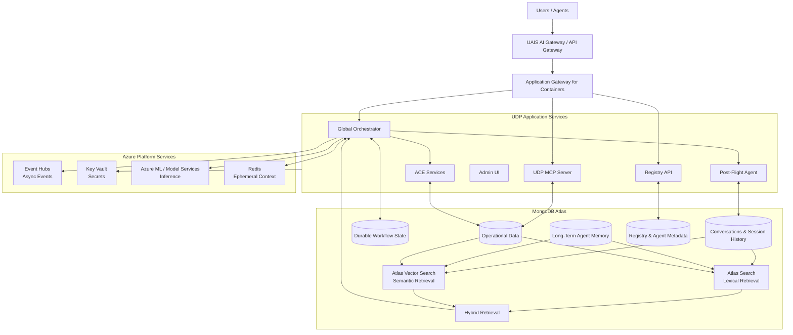
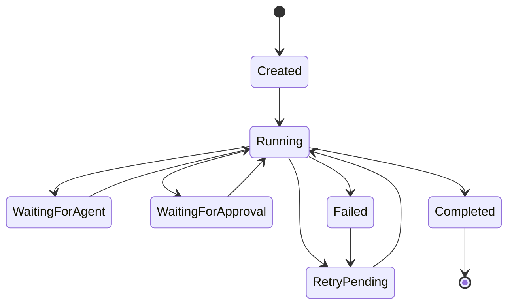
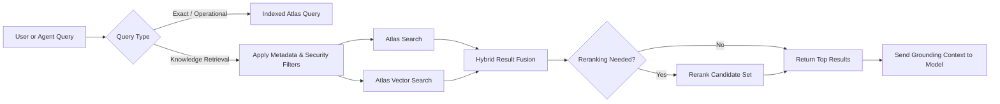
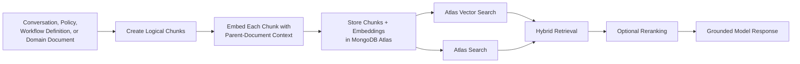
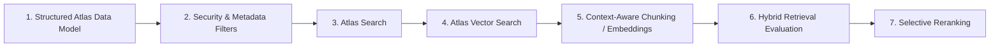

# UDP Domain Architecture TFW 
## MongoDB Atlas, Agent Memory, Workflow State, Search, Chunking, and Reranking

> **Architecture position:** MongoDB Atlas is not merely a downstream database in UDP. It is the durable operational state, memory, and retrieval platform supporting the agentic workflow.

---

## 1. Updated UDP Logical Architecture



### Core responsibility split

| Platform component | Primary responsibility |
|---|---|
| **Redis** | Short-lived working context, cache, and active-session data |
| **MongoDB Atlas** | Durable workflow state, operational data, conversations, long-term memory, registry metadata, audit history |
| **Atlas Search** | Full-text, lexical, filtered, and relevance-based search |
| **Atlas Vector Search** | Semantic retrieval over embedded content |
| **Hybrid Search** | Combines lexical and semantic retrieval |
| **Azure ML / model services** | Model hosting and inference |
| **Event Hubs** | Asynchronous events and workflow messaging |
| **Key Vault** | Secrets and credentials |

---

## 2. MongoDB Atlas Role in UDP

MongoDB Atlas serves as UDP's **operational system of record** and **persistent agent state platform**.

It can hold:

- durable workflow state;
- conversation and session history;
- long-term agent memory;
- registry and agent metadata;
- domain context;
- approvals and human-in-the-loop state;
- retry and failure information;
- event references;
- audit and recovery history.

> **Leadership message:**  
> MongoDB Atlas stores the durable state that allows UDP agents and workflows to survive across requests, failures, retries, and user sessions. Atlas Search and Vector Search operate directly over this data, minimizing duplication and synchronization between the operational database and a separate search platform.

---

## 3. Durable Workflow State in Atlas



A workflow-state document could include:

```json
{
  "workflowId": "wf-8c73d",
  "workflowType": "member-insight-generation",
  "status": "waiting_for_approval",
  "currentStep": "post_flight_review",
  "assignedAgent": "post-flight-agent",
  "sessionId": "session-4819",
  "retryCount": 1,
  "approval": {
    "required": true,
    "status": "pending"
  },
  "checkpoints": [
    {
      "step": "retrieve_member_context",
      "status": "completed"
    },
    {
      "step": "generate_insight",
      "status": "completed"
    }
  ],
  "createdAt": "2026-07-21T15:00:00Z",
  "updatedAt": "2026-07-21T15:03:21Z"
}
```

### Important design point

Workflow-state retrieval is usually **deterministic**, not semantic. Queries should normally use indexed fields such as:

- `workflowId`
- `sessionId`
- `status`
- `currentStep`
- `assignedAgent`
- `updatedAt`

Vector Search and reranking are generally unnecessary for these lookups.

---

## 4. Retrieval Architecture



### Recommended retrieval sequence

1. Classify the request.
2. Apply authorization and metadata filters.
3. Run Atlas Search, Vector Search, or both.
4. Retrieve a broader candidate set.
5. Rerank only where additional precision is needed.
6. Send a small, high-quality result set to the model.

Typical metadata filters include:

- user or member scope;
- business domain;
- document type;
- workflow;
- agent;
- permissions;
- effective date;
- source system;
- session or conversation.

---

## 5. Does UDP Need Reranking?

### Recommendation

**Design for reranking, but do not use it on every query.**

Reranking is useful when first-stage retrieval finds content that is related but does not reliably place the best answer first.

### Good reranking candidates

- long and messy conversation histories;
- policies with similar language;
- overlapping domain documentation;
- taxonomy or hierarchy retrieval;
- questions requiring comparison across multiple passages;
- hybrid search results where lexical and semantic signals disagree.

### Poor reranking candidates

- exact workflow ID lookup;
- session or registry lookup;
- strongly filtered operational queries;
- direct key-based access;
- latency-sensitive paths already producing high precision.

### Suggested pattern

| Stage | Typical result count |
|---|---:|
| Atlas Search / Vector Search retrieval | 30–100 candidates |
| Reranking stage | 20–50 candidates |
| Context sent to model | 5–10 results |

Reranking adds latency and cost, so its value should be demonstrated using real UDP evaluation queries.

---

## 6. Voyage Context 4 and Contextualized Chunk Embeddings

Voyage Context 4 is potentially valuable for UDP because many relevant content types lose meaning when split into isolated chunks.

Examples:

- a conversation turn that depends on an earlier user statement;
- a policy paragraph that depends on its section heading;
- a workflow step that depends on preceding steps;
- agent memory that depends on the overall session;
- a domain term whose meaning changes by business context.

### Conceptual flow



### What it improves

- contextual awareness of individual chunks;
- retrieval of passages containing ambiguous language;
- handling of long conversations and documents;
- resilience to imperfect chunk boundaries;
- precision before reranking.

### What it does **not** replace

Contextualized embeddings do not remove the need to choose sensible document and chunk boundaries. They reduce the damage caused by isolated chunks, but content still needs to be grouped logically.

---

## 7. Current Chunking Strategy

The older architecture diagram does **not** identify the current chunking implementation.

Possible implementations include:

- Semantic Kernel splitters;
- LangChain `RecursiveCharacterTextSplitter`;
- custom token-based splitting;
- application-specific splitting by conversation turn, section, workflow step, or function.

### Questions for the UDP team

1. What tool or library performs chunking today?
2. Is the current approach fixed-token, recursive, semantic, or structure-aware?
3. What are the chunk size and overlap?
4. Are conversations split by token count or conversational turns?
5. Are headings and parent metadata carried into each chunk?
6. Has chunking quality been evaluated using actual UDP questions?
7. Are embedded chunks regenerated when the source document changes?

---

## 8. Recommended Chunking by Data Type

| Data type | Recommended unit | Key metadata to retain |
|---|---|---|
| Conversations | Small groups of related turns | session, speakers, timestamps, domain |
| Policies | Section or subsection | title, heading hierarchy, effective date |
| Workflow definitions | Workflow step or logical stage | workflow type, step order, dependencies |
| MCP documentation | Tool or function definition | server, function, parameters, version |
| Agent memory | Event or summarized memory unit | user, session, agent, confidence |
| Agent logs | Session or bounded time window | workflow, severity, timestamp |
| Registry metadata | Usually no chunking | ID, type, version, owner |
| Workflow state | No semantic chunking | workflow ID, status, current step |

---

## 9. Recommended Implementation Priority



### Practical order

1. Model workflow state and operational records correctly.
2. Create deterministic indexes for operational access.
3. Apply security and metadata filters before retrieval.
4. Establish Atlas Search and Vector Search baselines.
5. improve chunking and evaluate Voyage Context 4.
6. Measure hybrid search against representative UDP questions.
7. Add reranking only to paths where evaluation shows a meaningful gain.

---

## 10. Key Architectural Takeaways

> **Atlas is the durable state engine.**  
> It stores workflow state, conversations, long-term memory, registry data, and operational records.

> **Search stays close to the source data.**  
> Atlas Search and Vector Search operate directly over Atlas data, reducing duplicate pipelines and synchronization lag.

> **Not every query is an AI retrieval query.**  
> Workflow-state and registry lookups should use deterministic indexed queries.

> **Contextual embeddings may reduce the need for aggressive reranking.**  
> Better chunking and Voyage Context 4 should be evaluated before making reranking universal.

> **Reranking is a precision tool, not an architectural requirement.**  
> Apply it selectively based on query complexity, measured retrieval quality, latency, and cost.

---

## 11. Concise Talk Track

> MongoDB Atlas is the durable operational foundation of UDP. It stores workflow state, conversations, long-term memory, registry metadata, and domain context. Redis remains appropriate for short-lived working context, while Atlas provides persistence, recovery, and auditability. Atlas Search and Vector Search support lexical, semantic, and hybrid retrieval directly over that data. For complex conversations and long-form domain content, Voyage Context 4 should be evaluated to improve chunk-level retrieval quality. Reranking should then be applied selectively where measured precision requires it, rather than adding latency and cost to every request.
