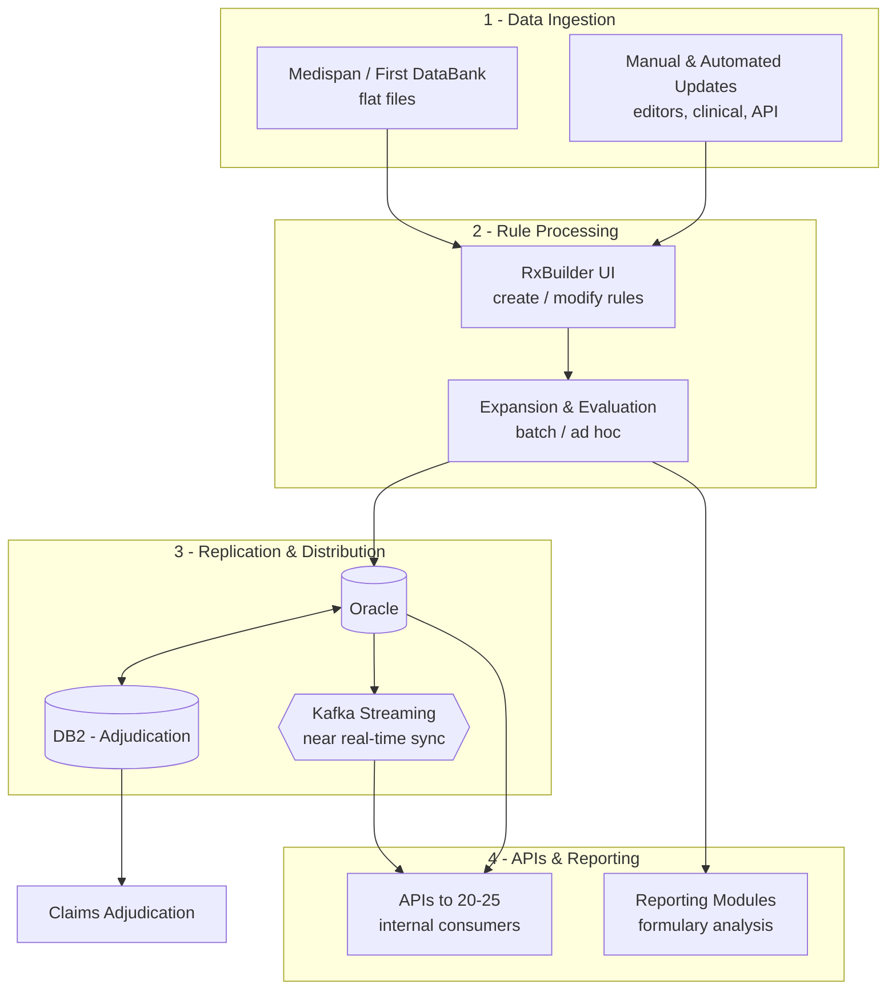
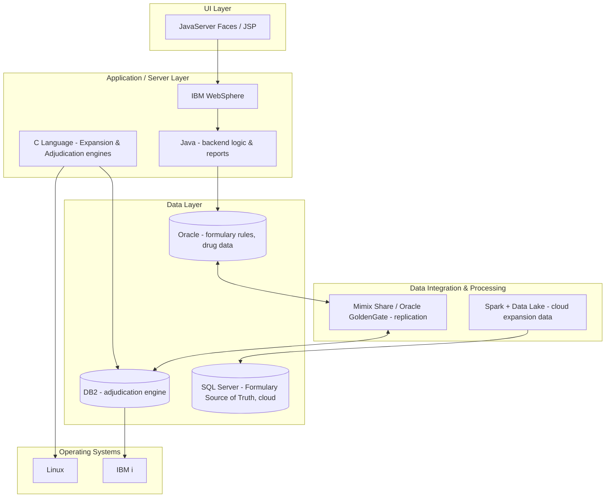
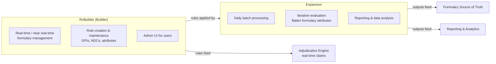

# RxBuilder - Application Overview & Modernization Brief

A structured overview of the RxBuilder application: its use case, users, business impact, modernization drivers, current and future state, data profile, technology stack, and key stakeholders.

---

## Table of Contents

1. [Application Use Case](#application-use-case)
2. [RxBuilder Users](#rxbuilder-users)
3. [Why Do Anything? (Business Impact)](#why-do-anything-business-impact)
4. [Biggest Challenges](#biggest-challenges)
5. [Why Now?](#why-now)
6. [Why MongoDB?](#why-mongodb)
7. [What Happens If They Don't Solve This?](#what-happens-if-they-dont-solve-this)
8. [Timeline / Milestone](#timeline--milestone)
9. [Current State](#current-state)
10. [Future State](#future-state)
11. [Competitive Information](#competitive-information)
12. [Data Flow](#data-flow)
13. [Data Sizing](#data-sizing)
14. [Tech Validation & Decision Process](#tech-validation--decision-process)
15. [Stakeholders](#stakeholders)
16. [Other Relevant Links](#other-relevant-links)
17. [Technology Stack (RxBuilder / Expansion)](#technology-stack-rxbuilder--expansion)
18. [RxBuilder vs. Expansion](#rxbuilder-vs-expansion)

---

## Application Use Case

### Formulary Management
- RxBuilder is a critical tool used to manage formularies, which include rules about drug coverage such as tier levels, prior authorizations, step therapies, etc.
- The application processes large quantities of drug data, formulary rules, and client-specific information to determine the formulary status of every drug.

### Rule Definition
- Users can create, modify, and evaluate complex rule sets for drugs using various drug identifiers and attributes. These rules decide the formulary status of drugs.
- The application handles daily updates to formulary rules and drug data, largely driven by changes from data providers like Medispan.

### Adjudication Support
- RxBuilder feeds into the adjudication engine, which uses these formulary rules during claims processing to determine drug pricing, eligibility, and coverage criteria.

### Reporting
- RxBuilder generates various reports for formulary analysis, expansion data comparison, and operational support. These reports help users analyze changes and ensure compliance with formulary guidelines.

---

## RxBuilder Users

**Formulary Editors / Operations Team**
- Responsible for creating, managing, and updating formularies and rules within RxBuilder. They define which medications are covered under different plans, tiers, and conditions (e.g., prior authorization or step therapy).
- Work daily with changes prompted by updates from external sources like Medispan, client requests, and clinician inputs.

**Clinical Teams**
- Interact with the Builder to incorporate updates based on clinical guidelines or client partnerships, which could involve rebates and preferred drug lists.

**Internal Consumers of Data and APIs**
- Approximately 20-25 internal consumers utilize APIs to access formulary data. These are other systems or departments needing formulary information for adjudication or operational decision-making.

**Reporting and Analysis Roles**
- Rely on reports generated from the Builder to ensure the formulary is set up correctly and to evaluate changes over time. They use reports to compare formulary setups at different times or to check the results of specific formulary rules.

RxBuilder is primarily used by internal teams focused on formulary management, clinical oversight, and administrative roles associated with healthcare plan management. These roles ensure healthcare plans are administered correctly, adjusting formularies in response to external changes and internal strategies.

---

## Why Do Anything? (Business Impact)

**Formulary Management and Compliance**
- RxBuilder is crucial for managing formularies, which are structured lists of medications covered by health plans, including complex rules around tier levels, prior authorizations, step therapies, and drug restrictions.
- Effective formulary management ensures the organization remains compliant with regulatory requirements and contractual obligations with healthcare providers and clients.

**Cost Management and Drug Pricing**
- By defining precise rules for drug coverage, RxBuilder helps control drug pricing and reimbursement processes, impacting the cost structure for the organization and its clients by promoting cost-effective prescribing and managing pharmacy benefit spend.

**Operational Efficiency**
- Supports streamlined operations by automating the processing of thousands of formularies and managing real-time updates to drug data and coverage rules, reducing manual effort and the likelihood of errors.

**Consumer and Client Satisfaction**
- Provides timely and accurate drug coverage information, ensuring patients have access to necessary medications without undue delays.
- The ability to quickly adapt formulary rules based on updated data or specific client needs helps maintain strong client relationships.

**Strategic Flexibility and Scalability**
- Modernization would allow RxBuilder to handle increased volumes from anticipated consolidation of formularies from other systems, positioning the organization for scalability and future growth.
- Advanced reporting and analytics from formulary and expansion data provide insights into drug utilization trends and opportunities for strategic formulary adjustments.

**Revenue Assurance**
- By ensuring accurate formulary rules and adjudications, RxBuilder helps ensure the health plan is billed correctly, drug rebates are managed properly, and potential disputes are minimized.

The planned modernization aims to enhance these impacts by improving system performance, data access, and the handling of greater complexity and volume, ultimately supporting UHC's strategic objectives more effectively.

---

## Biggest Challenges

**Scalability and Performance**
- *Increased Volume:* Handling more formularies and rules, particularly with plans to consolidate data from additional sources into RxBuilder, significantly increasing data processing requirements.
- *Resource Efficiency:* Improving time and computational resources for processes like adjudication and expansion given growth in data volume and complexity.

**Technical Modernization**
- *Legacy Systems:* RxBuilder relies on older legacy systems (Oracle databases, C code) that are less adaptable and more costly to maintain. Modernizing to MongoDB is necessary to improve efficiency and maintainability.
- *Microservices Architecture:* Moving from monolithic to microservices requires re-architecting the application and improving scalability, flexibility, and resilience.

**Integration and Compatibility**
- *Data Integration:* Ensuring seamless integration with other systems like the adjudication engine (currently on DB2), including real-time data replication and sync between database systems.
- *Expansion Process Alignment:* Aligning RxBuilder and Expansion processes, particularly while shifting Expansion to a modern data platform and maintaining operational continuity.

**Operational Dependency**
- *Maintaining Continuous Operations:* Maintaining seamless operations during the transition, where legacy and new systems may run in parallel, to avoid disrupting business-critical functions such as claims adjudication.

**Data Consistency and Accuracy**
- *Real-Time Updates and Feeds:* Ensuring rule and formulary updates are reflected accurately and in a timely manner across dependent systems, handling continuous replication, synchronization, and cross-system consistency.

Addressing these challenges requires strategic planning and phased execution to modernize RxBuilder while minimizing disruption to business operations.

---

## Why Now?

**Scalability Needs**
- As healthcare industry demands grow, so do data processing requirements. Expanding the ability to handle more formularies and higher data volume effectively requires modern technologies like MongoDB, which offer scalability that legacy systems struggle with.

**Performance Improvement**
- Modernization aims to optimize system performance, reduce processing times for complex calculations, and enhance response times for rule evaluations and claims adjudication. **200ms is the standard across UHG.**

**Cost Efficiency**
- Maintaining legacy systems is more expensive due to higher operational/maintenance costs and a dwindling pool of expertise in older technologies like C code and legacy databases. Modernizing enables more cost-effective long-term operation.

**Integrating Emerging Technologies**
- Leveraging generative AI and microservices architectures provides benefits including automation of routine tasks, improved development cycles, and better adaptability to future technological advancements.

**Strategic Alignment**
- Aligning IT infrastructure with broader digital transformation initiatives, improving data management practices, and supporting future innovations in healthcare delivery and management.

**Regulatory Compliance and Security**
- Modern systems come with enhanced security features and are more adaptable to evolving regulatory requirements, ensuring data integrity and protection.

**Business Continuity and Future-Proofing**
- Ensuring systems can continue to support business needs efficiently and adapt to anticipated regulatory shifts, market dynamics, or business growth.

**Competitive Advantage**
- Staying competitive by offering more efficient, reliable, and flexible healthcare solutions, leading to increased customer satisfaction and retention.

---

## Why MongoDB?

### Purpose of Modernization via App Modernization Factory

**Technology Update**
- Modernize RxBuilder from its current state (Oracle and DB2 databases alongside legacy technologies like C code and WebSphere) to a more efficient architecture leveraging MongoDB.
- Replace existing systems, improve data access, move business logic from stored procedures into the application tier, and eliminate technical debt.

**Efficiency Gains**
- Use generative AI to automate and speed up code conversion, test generation, and other tasks for faster development cycles and maintainability.
- Promises productivity improvements, potentially reducing modernization times by up to three times compared to manual efforts.

**Scalable Framework**
- Create a reusable, repeatable process for modernizing legacy systems across different applications at UHC.
- Reduce the long-term cost of maintaining multiple tech stacks by centralizing systems on MongoDB and leveraging modern data structures.

**Business Alignment and Scalability**
- Ensure RxBuilder can handle increased volumes and complexity from future integration projects, such as consolidating formularies from other systems.
- Improved scalability supports more extensive transactional and analytical workloads using MongoDB's document-based model.

---

## What Happens If They Don't Solve This?

- **Scalability Issues:** As formulary and rule volume increases, existing infrastructure may struggle to handle the load, causing performance bottlenecks and slow processing, resulting in delayed adjudication and reporting that affects operational efficiency and customer service.
- **Higher Operational Costs:** Maintaining legacy systems incurs higher costs due to specialized skills and rising maintenance/support expenses. As systems age, costs escalate further, reducing profitability.
- **Decreased Competitive Advantage:** Falling behind in modern technology adoption diminishes UHC's ability to offer agile, innovative solutions. UHC competes internally with its own systems; competitors offering faster, more reliable services may gain market share.
- **Regulatory and Compliance Risks:** Legacy systems may lack the flexibility to quickly adapt to new regulatory requirements, increasing the risk of non-compliance, fines, legal issues, and reputational damage.
- **Data Accuracy and Consistency Issues:** Without streamlined, modernized data processes, there is increased risk of errors in drug coverage and pricing, potentially leading to incorrect claims adjudication and customer dissatisfaction.
- **Inability to Support Business Growth:** Current systems may not scale or adapt to new business requirements (e.g., expanding formularies or integrating new offerings), limiting growth potential.
- **Increased Risk of System Failures:** Legacy systems are more prone to failures and downtime. In healthcare, such disruptions can seriously impact patient care and client satisfaction.
- **Difficulty Attracting and Retaining Talent:** Skilled professionals prefer modern technologies. Relying on outdated systems makes it challenging to attract and retain technical talent needed for ongoing improvements.

Addressing these challenges through modernization is crucial for UHC to maintain operational efficiency, control costs, comply with regulations, and continue to provide competitive, reliable services.

---

## Timeline / Milestone

- **Go-Live: January 2027**

---

## Current State

**Overview / Challenges**
- *(What exists and what doesn't. What pain does that cause.)* - To be completed.

**Negative Consequences (NCs)**
- *(What are the impacts to the stakeholder from this.)* - To be completed.

---

## Future State

*(Should be business-oriented, not tech-focused, and not in MongoDB terms.)*

### Overview
The overall vision is of a modern, efficient, and scalable RxBuilder system that provides robust support for business objectives, including handling current and future workloads elegantly, facilitating faster product improvements, and maintaining high data integrity and insight through enhanced reporting and analytics capabilities. This modernization enhances collaboration across teams, fosters innovation, and aligns with the organization's digital transformation goals.

### Positive Business Outcomes (PBOs) - Ideal State Components

**Modern Data Architecture**
- *Migration to MongoDB:* Transition from relational databases (Oracle, DB2) to a document-based model to improve data flexibility, reduce data-handling complexity, and support agile development.
- *Seamless Data Synchronization:* Implement real-time synchronization using Kafka or similar streaming technologies to ensure data consistency, reduce downtime, and enable faster access to updated data.

**Technology Stack Modernization**
- *Microservices Architecture:* Move toward a microservices-based architecture for modular, scalable, independent deployment of components.
- *Front-End Modernization:* Transition outdated UI technologies (e.g., JavaServer Faces) to modern frameworks like React, enhancing usability and maintainability.

**Data Management and Optimization**
- *Improved Data Handling:* Consolidate data workflows by archiving non-critical historical data and streamlining data transformation to improve storage efficiency and access times.
- *Performance Improvements:* Optimize rule and data processing pipelines for faster, more efficient formulary evaluations and updates, reducing overall processing time and system load.

**Enhanced Integration and Interoperability**
- *API-First Approach:* Expand and standardize APIs to facilitate better integration with internal systems, improve data exchange protocols, and enhance expandability and adaptability to new use cases.

**Operational and Business Alignment**
- *Support for Increased Workloads:* Ensure the platform can handle increased data volumes, such as a potential fourfold increase in formulary management, without performance degradation.
- *Reduced Technical Debt:* Address legacy code issues, transitioning business logic from embedded stored procedures into maintainable codebases for easier updates and long-term sustainability.

**Cloud-Ready Deployment**
- *Cloud Integration:* Keep architecture cloud-ready, supporting potential deployment onto cloud infrastructure alongside existing modernization plans and ensuring compliance with broader strategic objectives.

---

## Competitive Information

**For Expansion Data - Data Lake and Processing Solutions**
- *Apache Kafka (Confluent):* Provides real-time data streaming, potentially competing with MongoDB's capabilities for real-time applications.
- *Apache Spark:* A processing engine built for speed, analytics, and data handling, potentially overlapping with MongoDB's use in data transformations, particularly batch processing.

**Reasons to Compete (RCs)**
- *(RC - Benchmark - Prioritize, Differentiating, IMPACT)* - To be completed.

---

## Data Flow

**Data Ingestion**
- *External Sources:* Drug information is ingested from sources like Medispan and First DataBank, primarily as text/flat files loaded to update drug databases and formulary rules.
- *Manual and Automated Updates:* Formulary editors and clinical teams update formulary rules (manually or via API) based on client requirements, regulatory changes, or clinical data.

**Rule Processing**
- *Builder UI:* Users modify or create formulary rules via manual entry and batch imports.
- *Expansion and Evaluation:* Rules are processed in batch or ad hoc expansion to evaluate drug coverage and categorization, used in claims adjudication.

**Replication and Distribution**
- Data is replicated between Oracle and DB2, with rule data flowing to/from Oracle for consistency and availability across internal applications.
- A Kafka streaming mechanism may handle some data synchronization for near real-time updates across distributed systems.

**APIs and Reporting**
- APIs serve up-to-date formulary data to internal systems for operational decision-making.
- Reporting modules generate outputs including current formulary rules, changes over time, and comprehensive drug coverage reports.

---

## Data Sizing

**Size in Gigabytes / Terabytes**
- The largest RxBuilder environment holds approximately **159 GB** of data. Combined across similar environments, the total could be **under 3 TB** (rough estimate based on multiple environments of similar size).

**Row Counts**
- Large row counts within specific tables: one table potentially housing up to **3 billion rows**, and another with over **800 million rows**. These represent drug data, rule definitions, formulary setups, and historical information.

**Historical Data**
- Historical data volumes are significant, as updates are frequent, driven by changes from external datasets like Medispan, client requirements, and clinician updates.

---

## Tech Validation & Decision Process

**Tech Validation Process** - To be completed.

**Decision Process** - To be completed.

**PS Questions**
- Team's MongoDB experience
- Urgency
- Criticality
- Bandwidth
- Where do they lack experience that has high impact? (e.g., Sharding, Sizing, Performance tuning, Data Model)

---

## Stakeholders

| Name | Role | Notes |
| --- | --- | --- |
| Lalitha Singh | Leader, Engineering | |
| David Cattran | Lead Architect | |
| Navin Jain | Dir. SW Engineering, OptumRx | |
| Samir | | |
| Hari Hari Krishna | | |
| Wajhi | CTO | Executive Sponsor |

> **Still Need:** *(additional stakeholders to be identified)*

---

## Other Relevant Links

- What is a Formulary?
- SCHEMA Source of Truth
- Formulary - Part D API Mapping
- Formulary - Commercial API Mapping (Split)

> *Insert diagrams / screenshots below as needed.*

---

## Technology Stack (RxBuilder / Expansion)

**Web and Application Servers**
- *WebSphere:* The application runs on IBM WebSphere, a Java-based application server platform.

**User Interface Technology**
- *JavaServer Faces (JSF):* UI framework used for building web applications.
- *Legacy UI Technologies:* Older technologies like JSP may also be involved.

**Programming Languages**
- *Java:* Primarily used in the backend for application logic and business reports.
- *C Language:* Used for portions of business logic, particularly the Expansion and Adjudication engines.

**Databases**
- *Oracle Database:* Stores formulary rules, drug data, and related information.
- *DB2:* Used by the adjudication engine, possibly a legacy system handling critical data.
- *SQL Server:* Used for the Formulary Source of Truth in the cloud.

**Data Integration and Processing**
- *Replication Software:* Mimix Share and Oracle GoldenGate for database replication between Oracle and DB2.
- *Spark and Data Lake:* Used in cloud infrastructure for data processing/storage, particularly expansion data.

**Operating Systems**
- *Linux and IBM i:* C code components likely run on Linux; IBM i may host part of the legacy database and application components.

---

## RxBuilder vs. Expansion

RxBuilder (Builder) and Expansion are distinct but complementary components within the formulary management and drug adjudication processes at UHC.

### RxBuilder (Builder)
- **Formulary Management:** Creating, modifying, and maintaining rule sets and attributes associated with drug coverage; handles complex rule creation for how drugs are categorized, covered, and priced.
- **Rule-Based System:** Define rules based on drug identifiers (GPIs, NDCs) and other attributes to determine tiers, restrictions, and formulary characteristics.
- **User Interface:** Administrative interface for entering and managing formulary rules manually or via imports.
- **Integration with Adjudication:** Data and rules feed into the adjudication engine for real-time coverage and pricing decisions.
- **Real-Time Updates:** Rules and formularies are frequently updated to reflect changes from Medispan or client requirements.

### Expansion
- **Batch Processing:** Applies formulary rules against a comprehensive drug list to determine the status and attributes of each drug across formularies.
- **Iterative Evaluation:** Iterates over the entire set of drugs and formularies to flatten and calculate formulary attributes comprehensively (vs. real-time adjudication).
- **Reporting and Data Analysis:** Output is used extensively in reporting and analytics for formulary status and comparisons over time.
- **Daily Batch Runs:** Runs on a daily schedule, processing deltas or new batches to update formulary information.
- **Data Integration:** Results feed other systems, such as the Formulary Source of Truth, and support operational/analytical reporting.

### Key Differences

| Dimension | RxBuilder (Builder) | Expansion |
| --- | --- | --- |
| Processing Mode | Real-time / near real-time | Batch |
| Primary Purpose | Managing and creating rules | Applying rules across a large dataset |
| User Interaction | Significant (rule management) | Primarily automated backend process |

These components are complementary in managing and operating an effective formulary system, ensuring accurate drug coverage and pricing within the healthcare organization.
